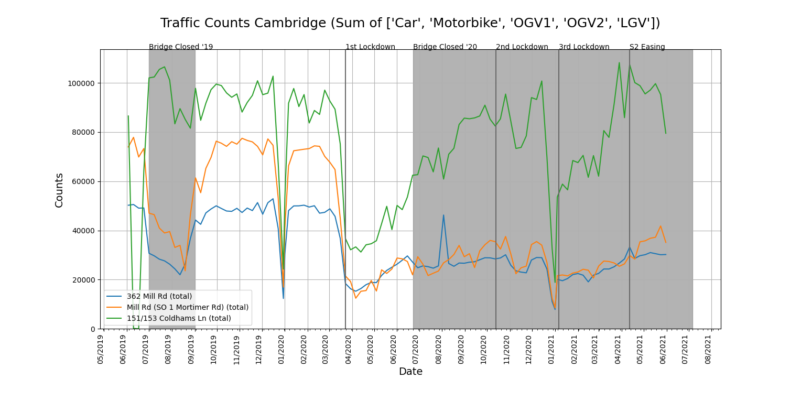

Mill Road Data Explorer
=======================

This python script can be used to explore data from the Cambirdgeshire Insight Open Data set for traffic (https://data.cambridgeshireinsight.org.uk/dataset/mill-road-project-traffic-sensor-data).

This is done with an eye to observing the affects of lockdown and bridge closure on Mill Road, Cambridge, UK

This code is freely available under the GPL v3.

The dataset is freely available under the UK Open Government Licence (OGL).

